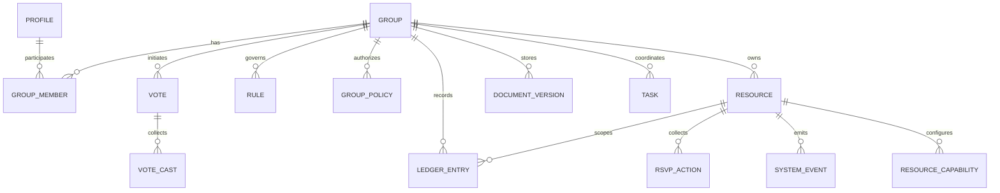

# Ruul — Vision canonical

**Status:** Canónica desde 2026-05-14. Founder directive.
**Reemplaza/consolida:** declara estrategia, posicionamiento, modelo de negocio, ontología, compliance, AI policy y GTM. Es la fuente de verdad por encima de `Constitution.md` (que queda como capa de enforcement técnico de los 12 artículos).

---

## Executive Summary

Ruul debe definirse, construirse y venderse como un **sistema operativo de coordinación humana**: un sistema de registro para grupos persistentes que acumulan miembros, reglas, recursos, decisiones, obligaciones y memoria verificable a lo largo del tiempo. Esa definición lo separa de tres categorías existentes que hoy dominan el mercado: herramientas de comunicación y trabajo en equipo orientadas por asiento y espacio de trabajo como Slack, Notion y Linear; herramientas de productividad individual o de equipo de proyecto; y utilidades transaccionales de un solo caso de uso. Slack cobra por usuario activo y exige subir de plan a todo el workspace; Notion factura por miembro y por workspace; Linear factura por usuario no suspendido dentro de un workspace y se presenta explícitamente como "the product development system for teams and agents". Esa lógica comercial y conceptual es útil para trabajo asalariado y desarrollo de producto, pero no modela bien una familia, un grupo de roommates, un palco, una asociación vecinal o una comunidad religiosa persistente.

La tesis final recomendada para Ruul es más estricta que la arquitectura SaaS tradicional: **dos primitivas centrales hoy, no más**. La primera es **Group**, entendido como sujeto operacional persistente dentro del sistema. La segunda es **Resource**, entendido como cualquier cosa que el grupo coordina y cuyo subtipo debe mantenerse congelado en un enum pequeño: `event`, `fund`, `asset`, `space`, `slot`, `right`. **Project** debe existir solo como primitiva futura y únicamente si el uso real demuestra que la coordinación rebasa lo que puede modelarse como recursos y eventos. Todo lo demás —identidad, membresía, permisos, reglas, votos, obligaciones, documentos, tareas, notificaciones, AI— debe vivir como capa transversal, no como explosión de nuevas tablas o nuevos "resource types". Esta decisión está alineada con tres tradiciones jurídicas y técnicas distintas: el **derecho civil** ordena el mundo en personas, bienes y obligaciones; el **common law/UCC** enfatiza promesas exigibles, propiedad, cesión y transferencias; y el **Talmud/halajá** organiza la vida civil alrededor de daños, custodia, disputa de propiedad, préstamo, renta y límites de dominio.

La regla cardinal del sistema debe formularse así: **acto > estado**. En términos de arquitectura, la verdad vive en átomos append-only: `system_events`, `ledger_entries`, `rsvp_actions`, `vote_casts`. En términos de contabilidad y sistemas distribuidos, esto coincide con la lógica de event sourcing y con la tesis de que "la verdad es el log; la base de datos actual es una caché materializada de una parte del log". Martin Fowler describe Event Sourcing como capturar todos los cambios del estado de una aplicación como una secuencia de eventos; AWS describe el event store como repositorio inmutable, append-only y fuente única de verdad; Azure, al combinar CQRS con Event Sourcing, subraya que el almacén de eventos puede ser la fuente única de la verdad y que las vistas materializadas deben derivarse de él; ACM Queue resume la intuición con una frase contable poderosa: los contadores no usan borradores, corrigen agregando nuevos asientos.

Con base en la auditoría interna provista por el equipo, Ruul ya tiene una base excepcionalmente buena para ejecutar esta tesis: recursos polimórficos, átomos append-only reales, rule engine server-side, y UI capability-driven. La deuda importante no es de ambición sino de ontología: inflación del enum de `resource_type`, varias fuentes de verdad paralelas para dinero y eventos, y workflows demasiado específicos por dominio. La recomendación binaria es simple: **congelar ontología ahora; limpiar legacy antes de añadir primitivas nuevas; y convertir la arquitectura actual en una constitución del producto**.

El modelo de negocio también debe alinearse con la ontología. La unidad de cobro no debe ser el "seat" individual sino el **grupo** y, de forma secundaria, los **módulos/capacidades** activados. Eso diferencia a Ruul de Slack/Notion/Linear no solo en precio, sino en filosofía del producto. La monetización recomendada es: suscripción base por grupo, límites amplios de miembros incluidos, cobro incremental por capacidades avanzadas (gobernanza, fondos, documentos/firma, AI, organización multi-grupo), y extrema cautela regulatoria si Ruul llega a custodiar fondos o a operar pagos. En México, el salto a operación financiera toca la Ley para Regular las Instituciones de Tecnología Financiera; en Estados Unidos, el análisis de money transmission depende de hechos y circunstancias, y FinCEN distingue entre procesamiento/settlement intrínseco a una transacción subyacente y transmisión de dinero como negocio separado.

Por último, este whitepaper concluye con cuatro decisiones que conviene tomar ya. Primero: **Ruul no es "calendar + fines + money"; es memoria institucional verificable para grupos**. Segundo: **la ontología vigente debe reducirse a Group + Resource ahora, con Project diferido**. Tercero: **las obligaciones deben tratarse como proyecciones derivadas de actos, reglas y relaciones, no como estados mutables privilegiados**. Cuarto: **AI solo puede proponer, resumir o ayudar a redactar; nunca puede aplicar reglas, mover dinero o mutar el sistema sin pasar por workflow humano verificable**. Esta última restricción no solo es prudente: también es consistente con NIST AI RMF, los principios de la OCDE y la Recomendación de UNESCO, todos centrados en confiabilidad, transparencia y supervisión humana.

## Visión, problema y tesis

### La visión

Ruul debe presentarse como la infraestructura donde un grupo persiste como unidad coordinada, conserva memoria institucional y puede operar sobre recursos, reglas y obligaciones sin depender de conversaciones perdidas, celdas de spreadsheet o aplicaciones verticales aisladas. En el derecho civil mexicano, la estructura básica que más ayuda a pensar este problema es la de **personas, bienes y obligaciones**: el Código Civil Federal reconoce personas morales en el artículo 25, organiza el Libro Segundo alrededor de los bienes y el Libro Cuarto alrededor de las obligaciones, donde el convenio y el contrato se definen como acuerdos que crean, transfieren, modifican o extinguen obligaciones. En common law, las categorías equivalentes son la persona jurídica, la propiedad y el contrato como promesa exigible; el UCC añade dominios concretos para ventas, leases y transfers. En la tradición talmúdica, Bava Kamma estudia daños, Bava Metzia estudia propiedad disputada, objetos perdidos, custodia, renta y préstamo, y Eruvin estudia un mecanismo jurídico que "mezcla" dominios y permite ampliar el espacio operativo de una comunidad bajo reglas precisas.

La síntesis útil para Ruul es la siguiente: **un grupo necesita sujeto, cosas, actos, reglas y límites**. El sujeto es el grupo; las cosas son resources; los actos son eventos append-only; las reglas determinan consecuencias; y los límites delimitan permisos, scopes y jurisdicciones operativas. Esa es la tesis fuerte del producto.

### El problema real que Ruul resuelve

Las herramientas líderes del mercado organizan información alrededor del trabajo, no alrededor del grupo persistente. Slack ofrece mensajería, listas, workflows y colaboración entre equipos; Notion organiza conocimiento y proyectos con facturación por miembro y workspace; Linear se define como sistema de desarrollo de producto para equipos y agentes. Ninguna de estas herramientas parte de una familia, una comunidad, un clan de viajes, un palco o un grupo de roommates como **sujeto persistente con recursos compartidos, reglas propias y memoria auditable**.

El vacío de mercado no es "otro chat" ni "otro PM tool". El vacío es un sistema que pueda responder preguntas como estas: quién pertenecía al grupo cuando se tomó una decisión; qué reglas estaban vigentes; qué recurso se comprometió; qué obligación nació; qué actos ocurrieron; qué estado actual deriva de esos actos; y qué parte de esa historia puede mostrarse a un nuevo miembro, a un tesorero, a un anfitrión o a un auditor. Esa necesidad existe tanto en contextos informales como formales. La diferencia es que la mayoría de los grupos no inician como persona moral estatal, pero sí operan como unidad coordinada mucho antes de incorporarse o constituirse formalmente.

### La tesis doctrinal

La tesis doctrinal final de Ruul puede expresarse en seis proposiciones:

1. **El grupo es el sujeto operativo del sistema**, aunque no sea automáticamente una persona moral o "legal person" bajo derecho estatal. En México, el Código Civil Federal enumera quiénes son personas morales; en Estados Unidos, una legal person es una entidad tratada como persona para poseer bienes, contratar, demandar y ser demandada. Por eso, Ruul debe distinguir entre el **subjecto interno del sistema** y la **personería jurídica externa** que puede o no existir fuera de la plataforma.

2. **Resource es la única cosa primaria coordinable hoy**. El subtipo describe la clase de cosa, pero no crea una nueva ontología.

3. **Acto > estado**. Si algo puede expresarse como acto append-only, no debe modelarse primariamente como estado mutable.

4. **Obligación es derivada**. Nace de la combinación de relación + acto + regla + cumplimiento/incumplimiento; no necesita, por principio, una tabla privilegiada si puede proyectarse de manera confiable.

5. **Capacidad y módulo son distintos**. La capacidad es una facultad atómica universal del sistema; el módulo es un bundle activable que combina capacidades, reglas semilla y UI.

6. **Toda entidad nueva debe pasar por un filtro ontológico antes de existir en DB**: sujeto, objeto, relación, acto, proyección, evidencia, workflow, gobernanza, configuración o capacidad. Si no encaja, probablemente no debe ser tabla.

### Lo que Ruul es y lo que no es

Ruul **sí es** un sistema de registro para coordinación persistente de grupos. No es un sustituto de chat, no es un calendario compartido, no es un gestor de issues de producto, no es una DAO on-chain, y no es un simple expense splitter. La mejor formulación pública es: **"Ruul ayuda a que los grupos vivan, decidan y recuerden como instituciones pequeñas"**.

## Ontología y arquitectura conceptual

### Ontología operativa recomendada

La ontología vigente recomendada para producción es:

- **Group**: sujeto persistente; tiene nombre, identidad, membresía, roles, políticas, reglas, módulos activos y plantillas de origen.
- **Resource**: objeto coordinado por el grupo; un enum estrictamente congelado a seis tipos.
- **Project**: primitiva futura; no debe entrar hasta que haya evidencia de coordinación multi-mes que no pueda modelarse bien como resource/event.
- **Layers transversales**: Identity, Membership, Permissions, Rules, Workflows, Atoms, Projections, Documents, Tasks, Notifications, AI.

La clave no es solamente reducir entidades; es **reducir el derecho interno del sistema a pocas clases invariantes**.

### Subtipos de Resource

La propuesta final para `resource_type` es esta:

| resource_type | Qué representa | Ejemplos |
|---|---|---|
| `event` | ocurrencia coordinada en el tiempo | cena, viaje, partido, junta, servicio religioso |
| `fund` | bolsa monetaria o tesorería | kitty, fondo de mantenimiento, caja común |
| `asset` | bien físico o digital con identidad persistente | casa, palco, equipo, contenido |
| `space` | lugar o recinto reservable o administrable | club, templo, terraza, sala |
| `slot` | capacidad temporal/escasa asignable | turnos, canchas, escritorios, asientos |
| `right` | derecho, acceso, membresía externa o uso | Costco familiar, afiliación, equity, derecho de voto o uso |

Este enum está jurídicamente y operativamente mejor justificado que un catálogo inflado de "settlement", "rotation", "assignment" o "guestPass". En derecho civil, las cosas apropiables y sus regímenes se tratan como bienes; en common law/UCC, ventas, leases, assignments y transfers son actos o relaciones, no categorías ontológicas universales de objeto; en Talmud, custodia y préstamo son regímenes de responsabilidad sobre una cosa, no géneros de cosa.

### Capas transversales

La ontología se vuelve estable cuando lo demás deja de competir con las primitivas:

| Capa | Función |
|---|---|
| Identity | perfiles, autenticación y enlace anon→phone→user |
| Membership | pertenencia al grupo y roles |
| Permissions | políticas, scopes, autoría |
| Rules | comportamiento automático y gobernanza |
| Workflows | votos, aprobaciones, revisiones, pendientes |
| Atoms | verdad append-only |
| Projections | vistas derivadas y estados consultables |
| Documents | evidencia y versiones inmutables |
| Tasks | coordinación de trabajo y pendientes |
| Notifications | entrega y recordatorios |
| AI | resumen, propuesta, asistencia, nunca aplicación directa |

### Clasificación de entidades actuales y objetivo

La siguiente tabla resume la parte más importante de la auditoría interna del equipo y traduce las decisiones binarias que deben entrar al ADR de constitución del producto.

| Entidad actual | Clase correcta | Decisión |
|---|---|---|
| `groups` | Subject core | Mantener |
| `group_members` | Relation | Mantener |
| `profiles` | Identity subject | Mantener |
| `resources` | Object core | Mantener |
| `resource_series` | Child de resource | Mantener |
| `resource_capabilities` | Config per-instance | Mantener |
| `rules` | Governance / behavior | Mantener |
| `group_policies` | Governance / permissions | Mantener |
| `system_events` | Atom | Mantener |
| `ledger_entries` | Atom | Mantener |
| `rsvp_actions` | Atom | Mantener |
| `vote_casts` | Atom | Mantener |
| `votes` | Workflow | Mantener |
| `pending_changes` | Workflow | Mantener |
| `events` | Legacy duplicada de `resources(type=event)` | Deprecar y borrar |
| `event_attendance` | Proyección sobre `rsvp_actions` | Deprecar y borrar |
| `fines` con status mutable | Proyección de actos y workflow | Refactor a vista derivada |
| `expenses`, `expense_shares` | Ledger legacy | Migrar y borrar |
| `pots`, `pot_entries` | `fund` + ledger | Migrar y borrar |
| `appeals`, `appeal_votes`, `vote_ballots` | Workflow/votos legacy | Migrar y borrar |
| `resource_type=settlement` | Acto de ledger | Eliminar del enum |
| `resource_type=contribution` | Acto de ledger | Eliminar del enum |
| `resource_type=proposal` | Workflow de voto | Eliminar del enum |
| `resource_type=assignment` | Relación o acto | Eliminar del enum |
| `resource_type=rotation` | Regla/comportamiento | Eliminar del enum |
| `resource_type=booking` | Acto sobre slot/space | No tratar como resource |
| `resource_type=guestPass` | Derecho/acto derivado | No tratar como resource |

### Diagrama de entidades principales



(Esquema completo en `Plans/Active/Constitution.md §13` filtro ontológico y `Plans/Active/AtomProjection.md` para clasificación de tablas.)

### Capability catalog y no inflación modular

La plataforma necesita un catálogo de capacidades pequeño y explícito: `scheduling`, `rsvp`, `check_in`, `ledger`, `voting`, `booking`, `availability`, `documents`, `tasks`, `notifications`, `activity`, `obligations`, `valuation`, `maintenance`, `ownership/access`. El valor de esta separación es que un módulo como "basic_fines" o "rotating_host" deja de redefinir el mundo: solo activa capacidades y reglas sobre primitives ya existentes.

**Source of truth:** tabla `public.capabilities` (mig 00165) seeded del iOS `CapabilityCatalog.swift`.

## Especificación técnica y gobernanza

### Principio técnico central

La especificación técnica final debe partir de un principio muy simple: **los modelos de escritura registran actos; los modelos de lectura describen estados**. Esa es la combinación más sana entre event sourcing y CQRS para un producto como Ruul. Martin Fowler, AWS y Azure convergen en lo mismo: el estado puede reconstruirse a partir de una secuencia de eventos; el event store es inmutable y cronológico; y las vistas materializadas existen para responder rápido, no para reemplazar la verdad.

### Átomos y proyecciones

| Tipo | Tablas / vistas | Regla |
|---|---|---|
| Átomos | `system_events`, `ledger_entries`, `rsvp_actions`, `vote_casts` | append-only, sin UPDATE/DELETE (guards en migs 00103/00162/00163/00166) |
| Workflows | `votes`, `pending_changes`, periodos de gracia/revisión | mutables, pero nunca fuente final de verdad |
| Proyecciones | `attendance_view`, `balance_view`, `fines_view`, `event_resources_view`, `vote_counts`, `user_actions` | recalculables |
| Evidencia | `document_versions` (futuro) | inmutable por versión |
| Coordinación | `tasks` + `task_events` (futuro) | estado proyectable sobre eventos |

La consecuencia práctica es inmediata: **multa pagada** no es `fines.status='paid'`; es un nuevo `ledger_entry(type='fine_paid')`. **Asistencia final** no es una fila "current_attendance"; es una reducción determinista de `rsvp_actions`. **Saldo** no es columna; es suma proyectada.

### Esquema propuesto

La base de datos propuesta para el siguiente ciclo no requiere rediseño total; requiere disciplina:

- `groups`, `group_members`, `profiles`, `resources`, `resource_capabilities`, `rules`, `group_policies`, `system_events`, `ledger_entries`, `rsvp_actions`, `votes`, `vote_casts` permanecen como núcleo.
- `documents` debe entrar como `document_versions` append-only.
- `tasks` debe entrar como tabla polimórfica de ownership (`group|resource|project`).
- `projects` queda diferido.
- Legacy tables deben sobrevivir solo durante migración, nunca como destino de nuevas features.

### Superficie de API recomendada

| API / RPC | Estado recomendado |
|---|---|
| `build_resource_from_draft` | Queda como constructor universal |
| `record_system_event` | Mantener |
| `record_ledger_entry` | Mantener y volverlo canónico |
| `set_rsvp_v2` | Mantener y convertir en ruta única |
| `start_workflow(kind, payload)` | Crear; reemplaza RPCs ad hoc |
| `cast_vote` / `finalize_vote` | Mantener |
| `has_permission` | Mantener como punto único |
| `create_group_with_admin` / `join_group_by_code` | Mantener |
| `create_document_version` | Nuevo |
| `create_task` / `complete_task` | Nuevo |

El criterio es evitar RPCs tipo `start_fine_appeal`, `record_settlement`, `create_event_v2`, `issue_manual_fine` cuando en realidad se trata de variantes de tres familias: construir resources, registrar actos, iniciar workflows.

### Lenguaje de reglas

El lenguaje de reglas debe seguir un formato estructurado, validado contra un catálogo de shapes permitidos, por ejemplo:

```json
{
  "trigger": "event.checked_in_closed",
  "scope": "resource",
  "conditions": [
    { "op": "member_missing_checkin", "within_minutes": 30 },
    { "op": "group_policy_enabled", "key": "missed_event_penalty" }
  ],
  "consequences": [
    { "kind": "emit_system_event", "type": "obligation.incurred" },
    { "kind": "record_ledger_entry", "entry_type": "fine_issued", "amount_cents": 5000 }
  ]
}
```

La regla técnica es: **las reglas evalúan hechos ya registrados; nunca inventan hechos no auditablemente justificables**.

### Determinismo y testing

El rule engine debe cumplir cuatro restricciones:

1. ejecución solo en servidor;
2. inputs exclusivamente versionados y fechados por backend;
3. consecuencias acotadas a un catálogo explícito;
4. replay completo posible sobre `system_events` y `ledger_entries`.

## Migración, UX y flujos

### Principios de migración

La migración correcta no es big-bang. Debe seguir cinco principios:

- **sin pérdida de datos**;
- **sin cambiar verdad dos veces**;
- **dual-read antes que dual-write**;
- **corte por dominios** (dinero, eventos, workflows, enum);
- **capacidad de replay** para verificar concordancia entre legacy y proyecciones nuevas.

La tensión entre append-only y privacidad se resuelve mejor si la identidad personal está separada del acto. Así, un derecho de cancelación/eliminación puede ejecutarse sobre datos identificatorios o mediante bloqueo/pseudonimización cuando la ley exija conservar ciertos registros, mientras los átomos no personales o legalmente retenibles persisten como historia auditable. La LFPDPPP define aviso de privacidad, consentimiento, derechos ARCO y bloqueo; CCPA reconoce derecho a borrar con excepciones y obliga además a coordinar a proveedores/contractors en el cumplimiento de dichas solicitudes.

### UX y navegación

La arquitectura de UX correcta ya está insinuada por la auditoría interna y debe preservarse:

- **Home** como bandeja de entrada personal y resumen cross-group.
- **Group** como centro de contexto del grupo.
- **Decisions** como tab cross-group separado, porque las decisiones pendientes viajan entre grupos.
- **Create** como constructor universal de resources.
- **Profile** reducido a identidad y cuenta; no debe ser vertedero de obligaciones y operaciones.

El patrón correcto para crear objetos es un **Resource Wizard declarativo**; el patrón correcto para verlos es una **Universal Resource Detail View capability-driven**. Esto no es solo una preferencia de UI: preserva la ontología y evita que cada caso nuevo genere un host especial y otra fuga de arquitectura.

### Flujos de producto recomendados

**Flow básico de evento con consecuencias**: crear resource `event` → invitar → RSVPs append-only → check-in → cierre → evaluación de reglas → obligaciones/ledger → apelación/voto si aplica.

**Flow de fondo compartido**: crear resource `fund` → registrar contributions y payments con `ledger_entries` → proyectar balances → votar cambios de reglas o acceso si aplica.

**Flow de derecho/uso**: crear resource `right` o `asset` con custodios → asignar uso mediante actos/workflows → proyectar historial y disponibilidad.

## Casos de uso, plantillas y producto

### Cobertura de 18 verticales sin cambiar primitives

| Vertical | Tipos mínimos |
|---|---|
| Familias | `event`, `fund`, `asset`, `right` |
| Roommates | `event`, `fund`, `asset`, `slot` |
| Cenas | `event` |
| Viajes | `event`, `fund`, `space` |
| Bodas | `event`, `fund` |
| Clubes | `event`, `fund`, `asset`, `space`, `slot`, `right` |
| Startups pequeñas | `event`, `fund`, `asset`, `right` |
| Comunidades religiosas | `event`, `fund`, `asset`, `space`, `right` |
| Asociaciones | `event`, `fund`, `asset`, `space`, `right` |
| Teams deportivos | `event`, `fund`, `asset`, `space`, `slot` |
| Coworking | `space`, `slot`, `right` |
| Gaming guilds | `event`, `fund`, `asset`, `right` |
| Palcos | `asset`, `right`, `slot`, `fund` |
| Voluntariado | `event`, `slot` |
| Parent groups | `event`, `fund` |
| Alumni | `event`, `fund` |
| Creadores | `event`, `fund`, `asset` |
| Masterminds | `event`, `fund` |

El punto importante no es que Ruul "sirva para todo", sino que esos verticales caben sin romper la ontología.

### Plantillas y módulos

Las plantillas deben seguir siendo **semillas**, no jaulas. Una plantilla no puede ser consultada en runtime para "decidir cómo funciona el grupo"; solo siembra defaults. Los módulos, por su parte, deben ser bundles comerciales y funcionales encima del catálogo estable de capacidades. La frontera correcta es:

- **Template**: punto de inicio.
- **Module**: paquete activable.
- **Capability**: unidad universal de comportamiento.
- **Rule**: norma concreta aplicada por un grupo o resource.

## Modelo de negocio, pricing y GTM

### Principio comercial

Si el sujeto primario es el grupo, **la unidad de precio principal también debe ser el grupo**. Cobrar por asiento como Slack, Notion y Linear empuja el producto hacia una ontología equivocada: individuos dentro de un workspace de trabajo. Ruul debe hacer lo contrario: facturar por grupo, incluir márgenes amplios de miembros y luego monetizar complejidad, riesgo operativo y módulos.

### Pricing recomendado

Las cifras siguientes son **recomendación comercial**, no benchmark normativo.

| Plan | Precio sugerido | Qué incluye | Para quién |
|---|---:|---|---|
| Comunidad | Gratis | 1 grupo, core events, RSVP, ledger básico, decisions, historial completo, export simple | cenas, roommates, familias |
| Grupo Pro | MXN $249–399 / grupo / mes | reglas avanzadas, fondos múltiples, roles/políticas, notificaciones, documents básicos, soporte prioritario | clubes, asociaciones pequeñas, palcos, trips recurrentes |
| Colectivo | MXN $799–1,499 / grupo / mes | tasks, documents avanzados, auditoría/export, governance avanzada, AI assist, múltiples admins | comunidades, coworking, clubes con operación continua |
| Organización | Venta consultiva | multi-group, federación, SSO, compliance pack, data residency options, soporte premium | asociaciones grandes, escuelas, iglesias, private communities |

Recomendación complementaria: **módulos add-on**, no "planes inflados". Ejemplos:

- Funds+ y treasury tools
- Governance+
- Documents & signatures
- AI Assistant
- Federation / multi-group
- Compliance export pack

### Go-to-market recomendado

El GTM inicial debe evitar el error clásico de "ir a todo vertical". Ruul necesita comenzar donde el dolor es alto y el switching cost es tolerable. Cuatro wedges naturales:

- cenas y anfitriones recurrentes;
- roommates y vivienda compartida;
- palcos / clubes de uso compartido;
- asociaciones y comunidades con reglas internas.

La tesis comercial es sencilla: **grupos que ya actúan como institución, pero hoy operan con chat + spreadsheet + memoria social**. Si el producto entra donde ya existe frecuencia, obligación y fricción, la adopción será mucho más rápida que en grupos casuales.

### Frontera regulatoria del dinero

Ruul puede registrar ledger y coordinar obligaciones sin convertirse de entrada en entidad financiera. Pero esa frontera cambia si Ruul **custodia fondos, ejecuta remesas o intermedia transferencias como negocio separado**. En México, la Ley para Regular las Instituciones de Tecnología Financiera se basa en principios de inclusión, innovación, protección al consumidor, estabilidad y prevención de operaciones ilícitas. En Estados Unidos, FinCEN señala que el análisis de money transmission depende de los hechos.

Por ello, la recomendación estratégica es binaria: **en las primeras fases, Ruul debe ser coordination ledger y no custodio financiero**.

## Seguridad, privacidad, cumplimiento y AI

### Línea base de seguridad

Ruul debe formalizar su baseline de seguridad alrededor de tres marcos: CSF 2.0 para gobierno de riesgo, NIST 800-63 para identidad/autenticación, y controles específicos de app/data security.

La implementación mínima razonable para Ruul es: MFA opcional pero promovido para admins; revocación real de tokens de notificación al cerrar sesión (ya cerrado, mig E-1.1); claves separadas por entorno; RLS/authorization centralizada; cifrado en tránsito y en reposo; separación estricta entre PII y atoms; export/audit logs para acciones administrativas; replays y backups verificables; y políticas de retención congruentes con obligaciones legales.

### Privacidad y cumplimiento en México (LFPDPPP)

Para México, la referencia primaria sigue siendo la LFPDPPP y su Reglamento. La ley define aviso de privacidad, derechos ARCO y condiciones de consentimiento; por regla general el tratamiento requiere consentimiento de la persona titular; los datos financieros o patrimoniales requieren consentimiento expreso; y los datos sensibles requieren consentimiento expreso y por escrito o un mecanismo equivalente de autenticación.

Consecuencias directas para Ruul:

- el **aviso de privacidad** no puede ser decorativo;
- el tratamiento de teléfono, identidad, finanzas u obligaciones monetarias debe mapearse a bases legales y consentimientos claros;
- la arquitectura debe soportar **acceso, rectificación, cancelación y oposición** (ARCO rights);
- y la separación entre identidad y átomos debe diseñarse desde ahora para no chocar después con solicitudes de cancelación o minimización.

### Privacidad y cumplimiento en Estados Unidos (FTC + CCPA/CPRA)

Para B2C/B2B pequeño-mediano debe considerar dos capas:

- **FTC**: puede perseguir prácticas injustas o engañosas en privacidad y seguridad. Recomienda recolectar solo lo necesario, protegerlo y desecharlo de manera segura.
- **CCPA/CPRA**: da derechos de conocer, borrar, optar por no venta/compartición, corregir y limitar el uso de información sensible. Exige notices, respuesta a solicitudes y contratos de service providers/contractors.

La conclusión práctica: aunque Ruul no nazca "enterprise", sí debe diseñarse con **processor contracts, deletion/correction workflows, access/export y minimización de datos** desde el principio.

### Documentos y firma electrónica

Si Ruul incorpora módulos de documentos, acuerdos o firmas, el marco legal de base es favorable, pero exige disciplina. En México, la Ley de Firma Electrónica Avanzada. En Estados Unidos, ESIGN y UETA sostienen la validez legal de contratos y registros electrónicos.

La recomendación de producto es: **document versions append-only, nunca overwrite; y firma como capa opcional, no como pretexto para mutar evidencia histórica**.

### AI layer y límites

La capa de AI debe construirse alrededor de cuatro límites no negociables:

1. **AI propone, no ejecuta**.
2. **Toda sugerencia entra como draft de workflow** (`pending_change`, `start_workflow`, borrador de regla, resumen explicable).
3. **Todo output debe citar contexto interno**: qué reglas vigentes, qué átomos, qué proyecciones.
4. **Debe existir supervisión humana significativa** para cualquier cambio con efectos normativos, económicos o reputacionales.

Esta postura es consistente con NIST AI RMF, OCDE, UNESCO.

La mejor forma de hacer compatible Ruul con AI no es "meter un chat con LLM", sino asegurarse de que el contexto de decisión esté bien estructurado: **átomos claros, proyecciones verificables, permisos explícitos y reglas tipadas**.

## Roadmap, métricas, riesgos y cierre

### Métricas de éxito

Ruul no debe medirse solo con installs o MAU. Necesita métricas de integridad institucional.

| Dimensión | Métrica sugerida | Meta inicial |
|---|---|---|
| Integridad ontológica | recursos creados dentro del enum canónico | 100% |
| Deuda de verdad | tablas legacy aún vivas con writes | 0 después de Fase 3 |
| Auditabilidad | % de estados críticos derivados de átomos | >90% |
| Flujo operativo | tiempo de proyección post-acto | <5 s |
| Gobernanza | tasa de finalización de votos iniciados | >70% |
| Salud de grupo | miembros activos / miembros totales por grupo | >60% |
| Retención | grupos activos a 90 días | >40% en wedges iniciales |
| Riesgo AI | % outputs AI que pasan a producción sin workflow humano | 0% |

### Riesgos principales y mitigaciones

El mayor riesgo sigue siendo la **inflación ontológica**. Cada nuevo vertical presiona para meter entidades nuevas. La mitigación es constitucional: filtro ontológico y ADR obligatorio antes de tocar el schema.

El segundo gran riesgo es la **coexistencia de múltiples verdades**. La mitigación es migración por dominios y eliminación progresiva de dual writes.

El tercer riesgo es la **colisión entre append-only y derechos de privacidad**. La mitigación es desacoplar identidad de acto, soportar bloqueo/pseudonimización y diseñar excepciones de retención por base legal.

El cuarto riesgo es la **deriva regulatoria del dinero**. La mitigación es mantener a Ruul, por ahora, como sistema de coordinación y registro, no como custodio de valor.

El quinto riesgo es el **uso irresponsable de AI**. La mitigación es diseño: AI sin write-path directo, sin auto-reglas en producción, sin "optimización" opaca de consecuencias, y con evidencias visibles para quien revisa.

### Checklist inmediato

1. Aprobar y publicar un **ADR constitucional** con la ontología final: `Group` + `Resource`, enum congelado a seis tipos, `Project` diferido. ✅ (Constitution.md + Vision.md, este doc, 2026-05-14)
2. Declarar oficialmente la regla **acto > estado** y usarla como criterio de review de schema y PRs. ✅
3. Congelar cualquier nueva tabla o `resource_type` que duplique dinero, reservas, propuestas o asignaciones. ✅ (mig 00147 + 00167 enforcement)
4. Empezar la **Fase de cleanup de money**: migrar legacy a `ledger_entries` y diseñar `fines_view`. ✅ (mig 00064 + 00149/150/151 + 00167)
5. Empezar la **Fase de cleanup de events**: preparar `event_resources_view` y `attendance_view`. ✅ (§14 step 5, mig 00152-00159)
6. Formalizar el **catálogo de capabilities** separado de módulos. ✅ (mig 00165)
7. Introducir el diseño base de **documents versionados** y **tasks polimórficos**. ⏳ pending — Phase 1 post-TestFlight
8. Resolver el bug operativo de **sign-out y revocación de tokens de notificación** antes de beta amplia. ✅ (E-1.1, `514d3c1`)
9. Implementar pruebas de **replay determinista** sobre atoms y reglas. ⏳ pending — Phase 1 post-TestFlight
10. Redactar el posicionamiento comercial público: **"pricing por grupo, no por seat"**. ⏳ pending — Phase 1 marketing

### Plan de comunicación

Internamente, el anuncio debe ocurrir en dos movimientos. Primero, una sesión ejecutiva y técnica donde se publique la "constitución" del producto. Segundo, una traducción operativa para diseño, mobile, backend y crecimiento.

Hacia usuarios beta, la comunicación debe evitar lenguaje abstracto. El mensaje no es "cambiamos nuestra ontología"; es: **"Ruul está consolidando su sistema para que la historia del grupo, sus reglas, sus eventos y su dinero sean más claros, auditables y confiables"**.

### Preguntas abiertas y limitaciones

Hay tres limitaciones que conviene registrar explícitamente:

1. El análisis del sistema actual se apoya en la **auditoría interna resumida por el equipo**, no en acceso directo al repositorio.
2. **El tamaño del equipo, el presupuesto y la ventana de release** no fueron especificados.
3. La sección legal es **arquitectura de cumplimiento**, no opinión legal formal; antes de activar pagos custodiales, firma avanzada con efectos fuertes o enterprise con datos sensibles, debe revisarse con asesoría externa.

### Cierre

La tesis final de Ruul es fuerte porque reduce, no porque agrega. Su mejor versión no es la que inventa más tipos, más tablas o más flujos; es la que hace que un grupo pueda **existir, coordinarse y recordar** con la misma seriedad con la que el derecho civil ordena personas, bienes y obligaciones; con la misma exigibilidad con la que common law trata promesas y propiedad; y con la misma fineza con la que el Talmud distingue daño, custodia y dominio. Si Ruul mantiene dos primitives, cuatro atoms canónicos y una disciplina constitucional de producto, puede convertirse en una categoría nueva.

La decisión correcta, hoy, es cerrar la ontología, limpiar los duplicados y construir sobre la arquitectura que ya existe. Esa secuencia no solo ordena el producto. Le da a Ruul la oportunidad real de volverse el **Human Coordination Operating System** que su arquitectura ya insinúa.

---

## Referencias canónicas

- `Plans/Active/Constitution.md` — los 12 artículos + filtro ontológico §13 + estado de cleanup §14 (enforcement layer)
- `Plans/Active/AtomProjection.md` — clasificación de tablas + guard coverage matrix
- `Plans/Active/Beta1.md` — journal de cenas (signal collection)
- `Plans/Active/Beta1Consolidation.md` — Beta 1 vertical actual (closed 40/40, 2026-05-14)
